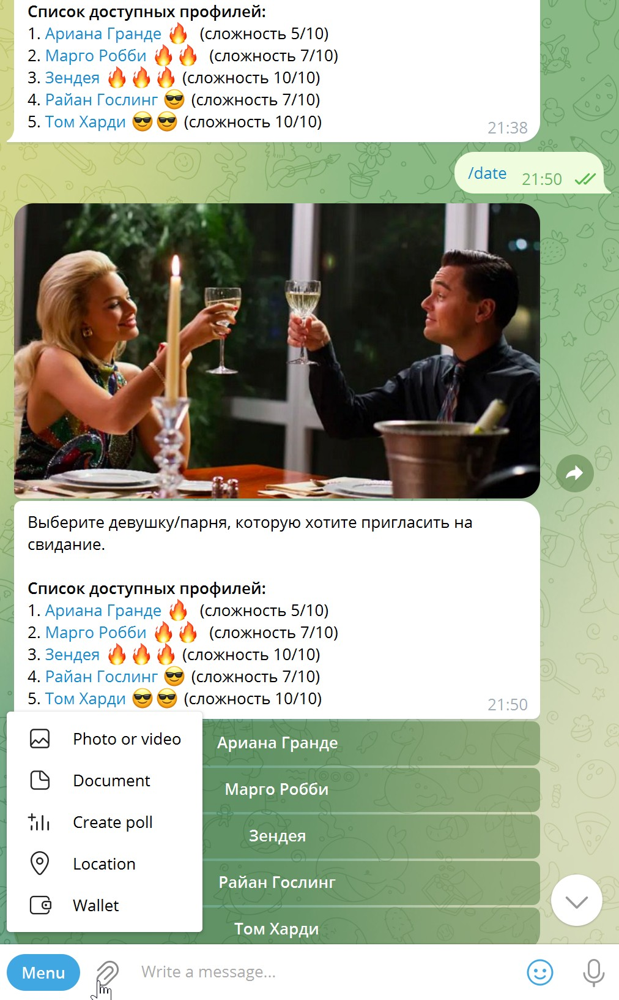

<h1> Телеграмм бот знакомств</h1>

## Описание
Версия программы: 0.0.1

## Реализованный функционал

- Генерировать Thinder-профиль по описанию
- Писать интересные и интригующие сообщения для знакомства.
- Вести переписку от вашего имени
- Вы можете тренироваться в переписках с чат-ботом

## Запуск

Клонируем проект в WebStorm.
Он находится по адресу https://github.com/igr76/MessBot
В классе main  подставить номер API Искуственного интелекта (строка 211) и номер API телеграмм бота (строка212)
Запускаем проект.

## Используемые технологии

- телеграмм
- axios 0.21.1
- node-telegram-bot-api 0.57.0
- openai  3.1.0
- puppeteer  22.11.2

## Автор проекта

- <a  href="https://github.com/igr76">Грицук Игорь</a>

